# The Quiz Game

The Quiz Game is an educational fun game aimed for user from 7 years and above. The aim is to know some basic general knowledge and create
interest in learning similar general knowledge. 

There are seven questions mostly about geography. This is a nice way in the beginning of learning.
The live link can be found here [The Quiz Game](https://farhatamannaislam.github.io/Quiz-Game/)

 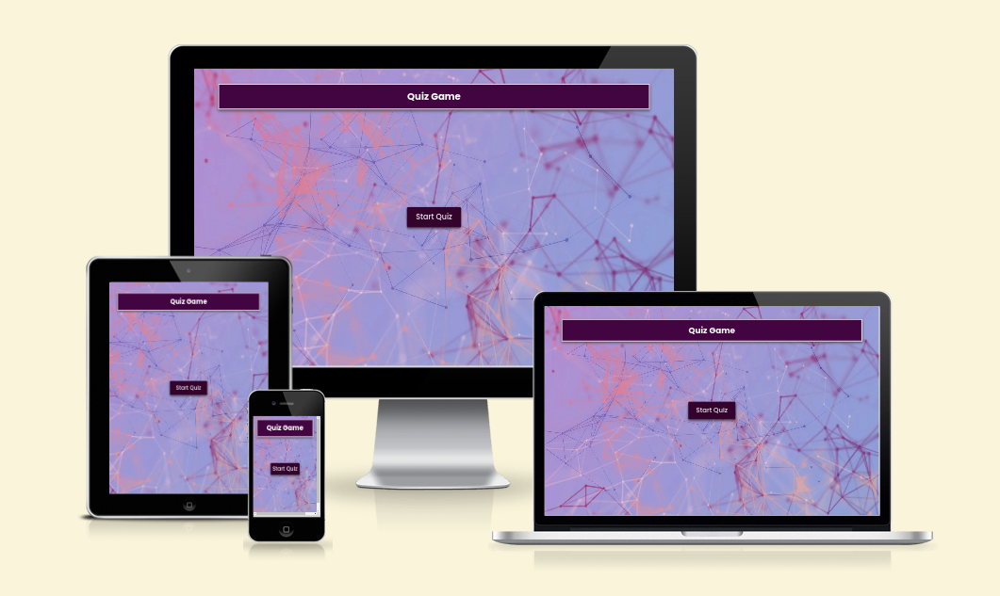

# Wirreframes

Desktop Wireframe

 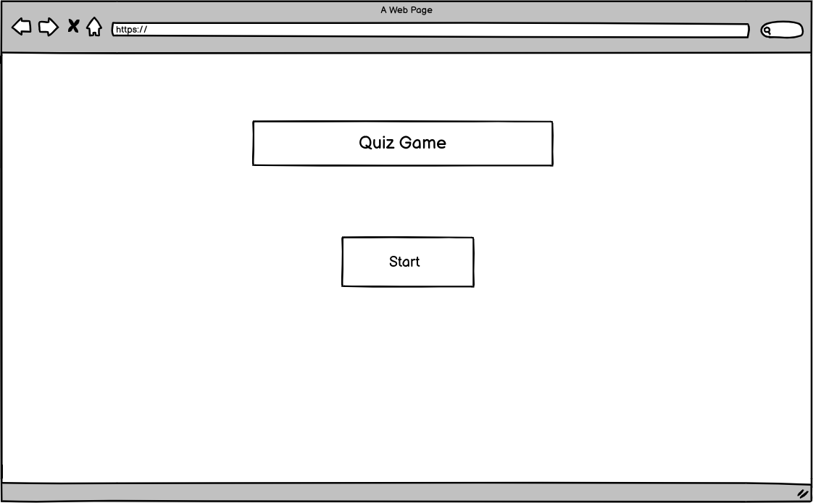

Desktop Wireframe

 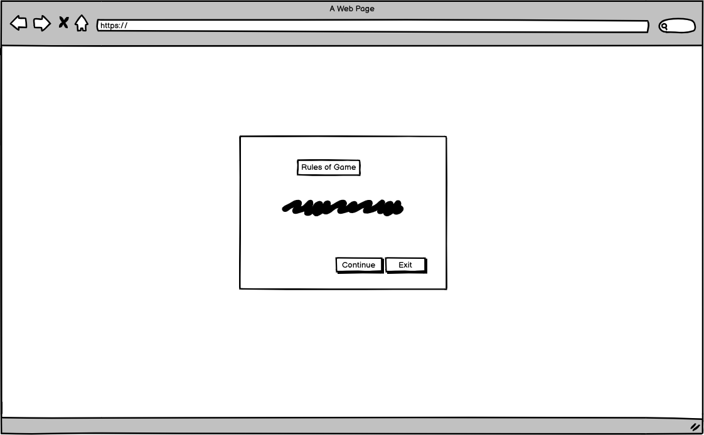

Desktop Wireframe

 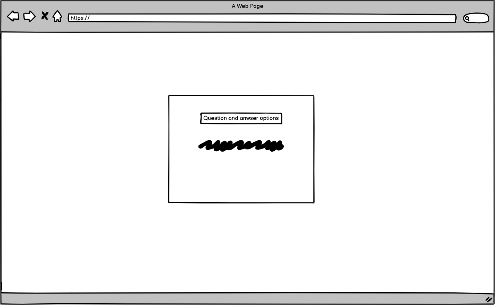

Desktop Wireframe

 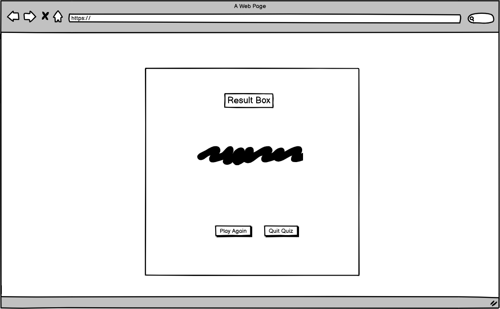

Mobile Wireframe

 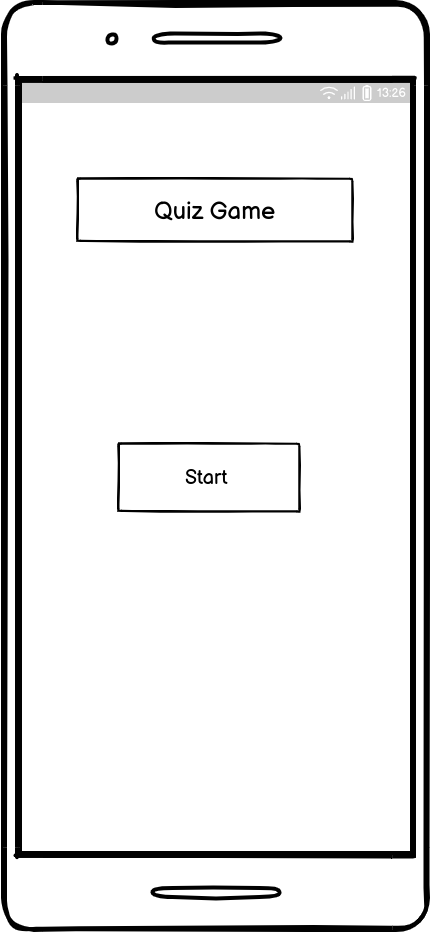

Mobile Wireframe

 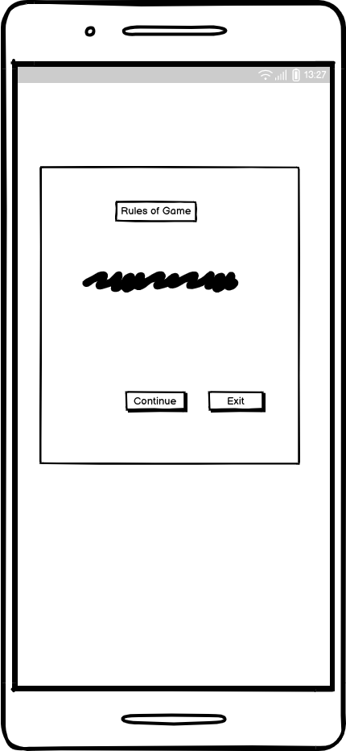

Mobile Wireframe

 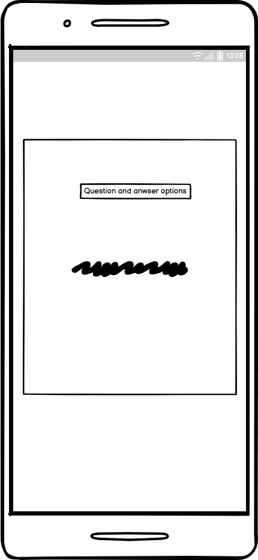

Mobile Wireframe

 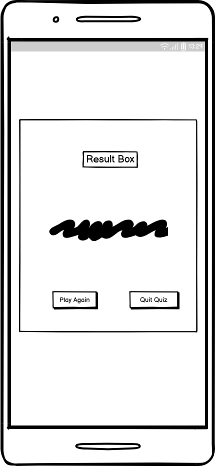

# Features

## Home Page

* The home page of the game is beautifully decorated witha purple backforund image. There is the tite of the game.
  Then there is the Start button to start the game with.

  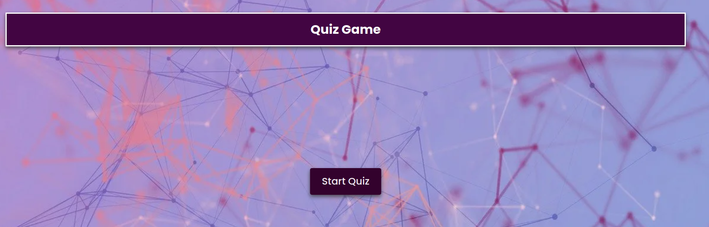

## Start Quiz

* Here the user gets the instructions about how to play the game.
* After that the user gets two buttons with options either continue the game or exit.

  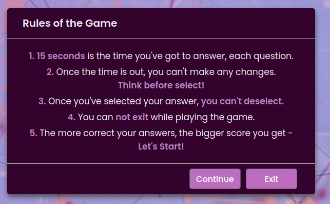

## Continue

* If the user decides to continue then he/she will be directed to the quiz. Here seven questions will be found each with four
answer options.
* Based on correct answers positive scores would be calculated. Based on wrong answers negative score would be calculated.
* User will get 15 seconds to answer each question.
* If he/she can't answer within this time there will be a negative score for that question.
* There is no excape from the game while playing.

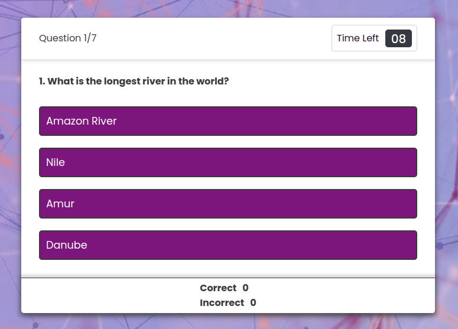

## Exit

* If the user decides to exit he/she will be redirected to home page again.

## Result

* At the end of the game score is shown with a beautiful crown icon in score box.
* There are two buttons inside the result box. One is Play Again and another is Quit Quiz.
* The user can continue to play again. Each time the game starts the questions and answers are shuffled.
* If the user chooses Quit Quiz again the Game will be redirected to home Page.

  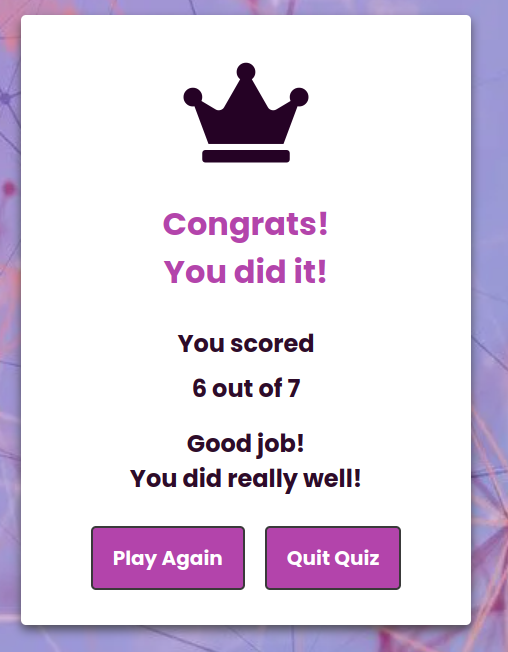

# Testing

## Validator Testing

### HTML
* No errors were returned when passing through the official W3C Markup Validator.
        [W3C Validator Results](https://validator.w3.org/nu/?doc=https%3A%2F%2Ffarhatamannaislam.github.io%2FQuiz-Game%2F)

### CSS
* No errors were found when passing through the official W3C CSS Validator.
        [W3C CSS Validator Results](https://jigsaw.w3.org/css-validator/validator?uri=https%3A%2F%2Ffarhatamannaislam.github.io%2FQuiz-Game%2Fassets%2Fcss%2Fstyle.css&profile=css3svg&usermedium=all&warning=1&vextwarning=&lang=en)

### Javascript
* No errors or warnings were returned when passing through the the [JSHint Validator](https://jshint.com/)
        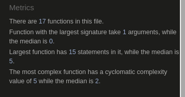

## Accessibility

* The site achieved a Lighthouse accessibility score of 100% which confirms that the colours and fonts chosen are easy to read and accessible.

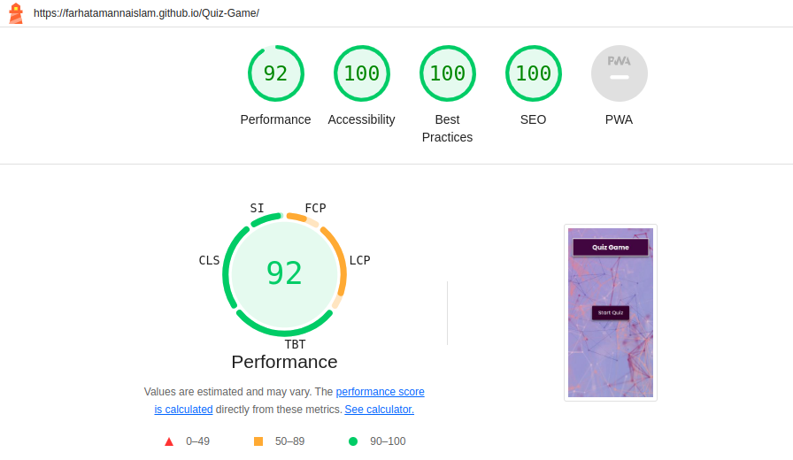

## Button Testing

* All buttons were tested manually to ensure the user is directed to the correct section of the website and functions run as intended.

## Game testing

* The Game was played by multiple people several times to ensure that it works correctly.

## Browser Testing

* The Website was tested on Google Chrome, Firefox, Microsoft Edge, Safari browsers with no issues noted.

## Device Testing

* The website was viewed on a variety of devices such as Desktop, Laptop, Smartphone to ensure responsiveness on various screen sizes in both portrait and landscape mode.

* Responiveness has been tested by following websites:
     [Responsitor](http://www.responsinator.com/?url=https%3A%2F%2Ffarhatamannaislam.github.io%2FQuiz-Game%2F)
     [Am I Resonsive](https://ui.dev/amiresponsive?url=https://farhatamannaislam.github.io/Quiz-Game/)

